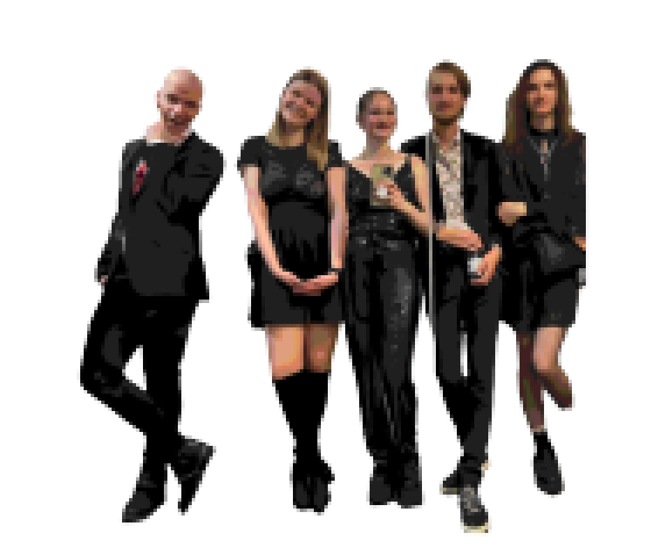
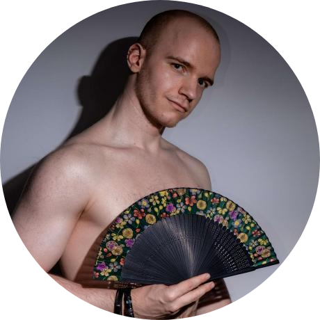

# welcome!! 

## 🕸 Quickfire 🕸

- 👻 I’m snadster! 
- ☠️ I’m currently learning about Advanced algorithms, and operating systems
- 👀 I’ve almost taught myself HTML
- 🦴 Currently, I'm working on a general amount of small art-esque projects
- 🤍 The art used here is mine! The stickers are grabbed from web badges world

 
 

## 🎃 Skills 🎃
Bearing in mind that skills here is to mean I could feasibly operate within these systems and write small programs.

  
   
   
   

  
  
  
  
  

## 🦇 Digital life 🦇
### 🐍 Facts of Existence 🐍
How *do* I exists within the tiny screen of my computer, you ask? With great care and minimal effort.

  
  
   
   
  
  
  
  
  [![CSP](https://img.shields.io/badge/Clip%20Studio-FFF.svg?logo=data:image/svg%2Bxml;base64,PHN2ZyByb2xlPSJpbWciIHZpZXdCb3g9IjAgMCAyNCAyNCIgeG1sbnM9Imh0dHA6Ly93d3cudzMub3JnLzIwMDAvc3ZnIj4gIDx0aXRsZT5DbGlwIFN0dWRpbyBQYWludDwvdGl0bGU+ICA8cGF0aCBkPSJNMTIuOTgzIDguMTA2czEuNzUtLjI1MyAyLjE1MS42OWMuNC45NDEuNTgxIDEuNTIzLS4yNiAyLjAwNEMxNC4wMzEgMTEuMjggOSAxMy4zNjYgOSAxMy4zNjZzLTMuNzg4IDEuNTQzLTYuMTU0LTEuNjA0LjItNS40OTMuMi01LjQ5My44NDMtLjg4MiAyLjkyOC0xLjcwMyA1LjYxMi0yLjA4NSA1LjYxMi0yLjA4NSAzLjI4Ny0uNzIxIDUuNjkzLjE4YzIuNDA2LjkwMiAzLjk3IDIuODA3IDMuOTcgMi44MDdzMS43NjMgMS45MjQgMS42ODMgNC4zM2MtLjA4MiAyLjQ2LS43NDIgMi45MDYtLjc0MiAyLjkwNnMtMS4yODMgMi43NDYtNC4zOSAzLjg4OS0zLjg2OSAxLjU4My0zLjg2OSAxLjU4M2wxLjM2NCAyLjE0NXMuNzgxIDEuNTg0LS44MjIgMi4wNjVjLTEuNjA0LjQ4LTIuMzg2LS42NjEtMi4zODYtLjY2MUw4LjggMTYuODUzbDguMjM4LTMuNjI4czIuNjQ2LTEuODQ0IDIuMzg2LTMuNzI4Yy0uMjUtMS44MTEtMS4yMjMtMy4wMjctMi41MjYtMy43NDktMS41MjMtLjk0Mi0yLjg2Ni0uNzAxLTIuODY2LS43MDFzLTEuNDY0LjIyLTMuMTg4Ljk0MmMtMS45MjQuNzIxLTQuMzUgMS44MDQtNC4zNSAxLjgwNHMtMS40NjMuNDYtMS4wNDIgMS42MjRjLjQyMSAxLjE2MiAxLjY4NCAxLjA2MiAxLjY4NCAxLjA2MnoiLz48L3N2Zz4=)](#)

### 🦝 Socials 🦝
Are you trying to contact me?

  

   
   
  
  
  
  
  <!--  -->

---

## 🍃 Personal 🍂
I do a bunch of art, eventually I'll upload it all someplace and link to it but for now my source is "trust me bro". 

 
 
 

 
 

## 🩸 Friends 🩸

   
   

  <a href="https://github.com/Marcus543211">
  <a href="https://github.com/OliviaJespersen">
  <a href="https://github.com/sofielofberg">
  <a href="https://github.com/DrFisk0">

<!---
snadster/snadster is a ✨ special ✨ repository because its `README.md` (this file) appears on your GitHub profile.
You can click the Preview link to take a look at your changes.
--->
